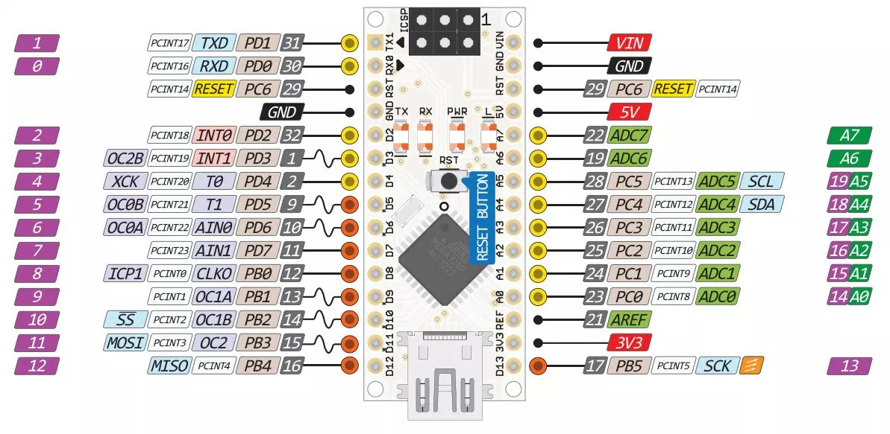
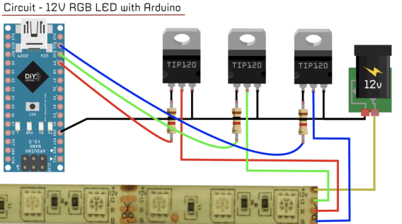
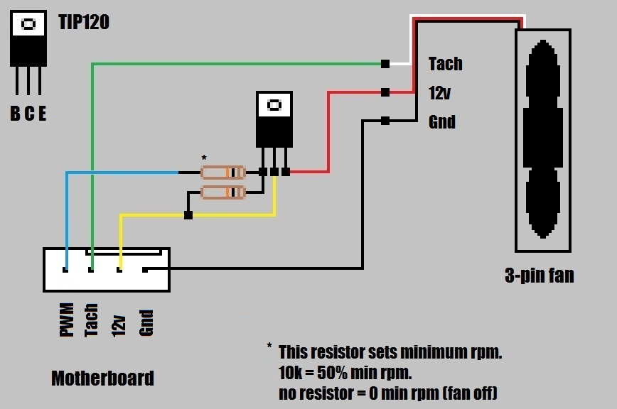

## Ctrl+Shift+V to see dynamic preview in VScode

# Important NOTE: This is work in progress. Do not clone it at this stage.

# OVERKILL-3D ARDUINO CONTROL BOARD

## Project Summary

> An Arduino based controller board which can serially interface with PC devices (computer / raspberry pi) via USB port to receive instructions or to transmit sensor / status data.

> Board BOM
>
> - Arduino Nano
> - 8x Relays (RELAY_ENC_FAN | SSR_PRINTER_POWER | TBA | TBA | TBA | TBA | TBA | TBA)
> - 2x 5050 LEDs Strips
> - 2x Humidity and Temperature Sensors (for control and enclosure) using DTH22
> - 2x Smoke Sensors Q135 (one installed in enclosure and one in exhaust port)
> - 2x Toggle Buttons for Digital Inputs

> ## Pin Assignment

> 

 Mega328 Pins | Pin Defination | Assigned Peripheral
 ------------ | -------------- | -------------------
 Pin 01       | PD1 / TxD      | Relay_1
 Pin 02       | PD0 / RxD      | Relay_2
 Pin 03       | PC6 / RESET    |
 Pin 04       | GND            |
 Pin 05       | PD2            | Relay_3
 Pin 06       | PD3 (PWM)      | CH2_RED
 Pin 07       | PD4            | Relay_4
 Pin 08       | PD5 (PWM)      | CH2_BLUE
 Pin 09       | PD6 (PWM)      | CH2_GREEN
 Pin 10       | PD7 (PWM)      | Relay_5
 Pin 11       | PB0            | Relay_6
 Pin 12       | PB1 (PWM)      | CH1_RED
 Pin 13       | PB2 (PWM)      | CH1_BLUE
 Pin 14       | PB3 (PWM)      | CH1_GREEN
 Pin 15       | PB4 (PWM)      | Relay_7  
 Pin 16       | PB5            | Relay_8
 Pin 17       | 3V3            |
 Pin 18       | AREF           |
 Pin 19       | PC0            | DH22 Temp and Humidity Sensor (Control Board)
 Pin 20       | PC1            | DH22 Temp and Humidity Sensor (Enclosure)
 Pin 21       | PC2            | MQ125 Smoke Sensor (Control Board)
 Pin 22       | PC3            | MQ125 Smoke Sensor (Enclosure)
 Pin 23       | PC4            | Push Button (LED Test)
 Pin 24       | PC5            | Push Button (RELAY Test)
 Pin 25       | ADC6           |
 Pin 26       | ADC7           |
 Pin 27       | +5VDC          |
 Pin 28       | PC6 (RESET)    |
 Pin 29       | GND            |
 Pin 30       | VIN            |

> ## Serial via USB configuration

> The serial communication with done using a "G-Code" like syntaxes where the first letter will refer to the 

> Serial Frame Constructor

> Data Frame from Computer to Arduino
> Commands Turn on LED power, Turn On 

## PWM Pin Configuration

> PWM write example -> val = analogWrite(ledPin, val /4);
> AnalogRead values go from 0 to 1023. analogWrite values from 0 to 255. Available PWM pins -> 3, 5, 6, 9, 10, 11

## MOSFET Control Circuit

> A relay can provide simple On/Off control however devices like LED and FAN require a "control" singnal to regulate brightness or speed. This can be achieved by using PWM channels of the microcontroller connected to gate pin of power MOSFET which in this case will be NPN TIP120. These MOSFETs have higher current carrying capacity along with higher voltage rating.

### MOSFET 5050 RGB LED Control Circuit

> In this circuit we will use 3x TIP120 (NPN) MOSFET per LED Strip. Each MOSFET will control the RGB line individually. To keep thing relatively simple, we will implament this circuit with the asumption that at 0 duty cycle there will be no current lekage from these MOSFETs and the device will come to complete shutdown.
> 

## Enclosure FAN control (with color)

> A cheap Chinese manufactured 120x120mm DC 12V Fan (with 15 LED) will be used as enclosure exhaust fan. Sample Circuit shown below:
> 
> credit: https://www.techpowerup.com/forums/threads/so-you-want-pwm-control-of-your-new-cpu-fan.107135/

> ## DH11 Humidity and Temperature Sensor Setup

> [Youtube Video 1](https://www.youtube.com/watch?v=nssXWNYdGT8)
> 
## MQ135 Air Quality Sensor Setup
> [Youtube Video 1](https://www.youtube.com/watch?v=Ku4Y29XPyyo)
